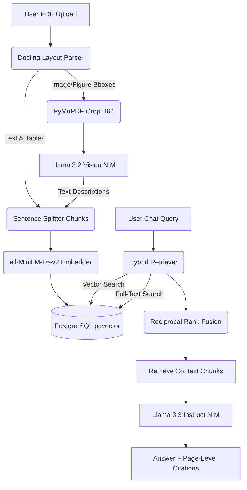

# 🌌 PRISM — Multimodal Document Intelligence Platform

[](LICENSE)
[](https://nextjs.org/)
[](https://fastapi.tiangolo.com/)
[](https://www.postgresql.org/)

**PRISM** is a production-grade, AI-powered Full-Stack Multimodal Document RAG (Retrieval-Augmented Generation) platform. It parses complex PDFs, extracts structured tables, describes visual charts using vision models, and answers user queries with pixel-perfect page-level citations and an interactive document viewer.

---

## 🔗 Live Deployments

* **🖥️ Live Web App (Frontend)**: [prism-mehrasam825.vercel.app](https://prism-mehrasam825.vercel.app)
* **⚙️ Live Backend API**: [prism-backend-xvhd.onrender.com](https://prism-backend-xvhd.onrender.com)
* **💻 GitHub Repository**: [github.com/sarthakmehra02/Prism](https://github.com/sarthakmehra02/Prism)

---

## 🚀 Key Features

* **Multimodal Vision RAG**: Automatically crops charts/figures via PyMuPDF and generates descriptive summaries using **Llama 3.2 Vision** for vector indexing.
* **Layout-Aware PDF Ingestion**: Uses **Docling** to parse sections, lists, and tables directly into structured markdown chunks.
* **Hybrid Search (Vector + FTS + RRF)**: Combines semantic vector similarity (`all-MiniLM-L6-v2` embeddings via `pgvector`) with PostgreSQL Full-Text Search, fused together using **Reciprocal Rank Fusion (RRF)**.
* **Interactive Citations**: Under-response citation badges map directly to the source PDF pages. Clicking a badge loads the document at the exact cited page.
* **ChatGPT-Style Workspaces**: Seamless multi-chat sessions with auto-titling, renaming, delete support, and workspace document isolation per session.
* **Secure User Access**: Isolated document workspaces using Firebase Auth validation on both frontend and backend.
* **Export & Sharing**: Export chat transcripts as formatted Markdown or PDF, and generate public, read-only session links.

---

## 🧱 Architecture Flowchart



---

## ⚙️ Environment Variables

Create a single `.env` file in your root workspace:

```env
# Database Credentials
DATABASE_URL=postgresql://postgres:pass@db:5432/postgres

# NVIDIA NIM API Keys
NVIDIA_API_KEY=nvapi-your-key-here
NVIDIA_BASE_URL=https://integrate.api.nvidia.com/v1
NVIDIA_MODEL=meta/llama-3.1-8b-instruct
NVIDIA_VISION_MODEL=meta/llama-3.2-11b-vision-instruct

# Firebase Client configuration (Frontend)
NEXT_PUBLIC_FIREBASE_API_KEY=your_firebase_api_key
NEXT_PUBLIC_FIREBASE_AUTH_DOMAIN=your_project_id.firebaseapp.com
NEXT_PUBLIC_FIREBASE_PROJECT_ID=your_project_id
NEXT_PUBLIC_FIREBASE_STORAGE_BUCKET=your_project_id.appspot.com

# Firebase Admin configuration (Backend)
SERVICE_ACCOUNT_JSON={"type":"service_account",...}
```

---

## 📦 Getting Started (Docker Compose)

Launch the entire stack (Postgres database, FastAPI backend, Next.js frontend, and Nginx proxy) with one command:

```bash
docker-compose up --build
```

Once loaded, access the platform locally at:
* **Web Workspace**: [http://localhost](http://localhost) (Nginx port 80 proxy)
* **Backend Docs / API Sandbox**: [http://localhost/api/docs](http://localhost/api/docs)
* **Health API Check**: [http://localhost/api/health](http://localhost/api/health)

---

## 🧪 Running Tests

To run the Pytest suite for parser, chunking, and RRF correctness:

```bash
docker-compose exec backend pytest
```

---

## 📄 License

This project is licensed under the MIT License - see the [LICENSE](LICENSE) file for details.
